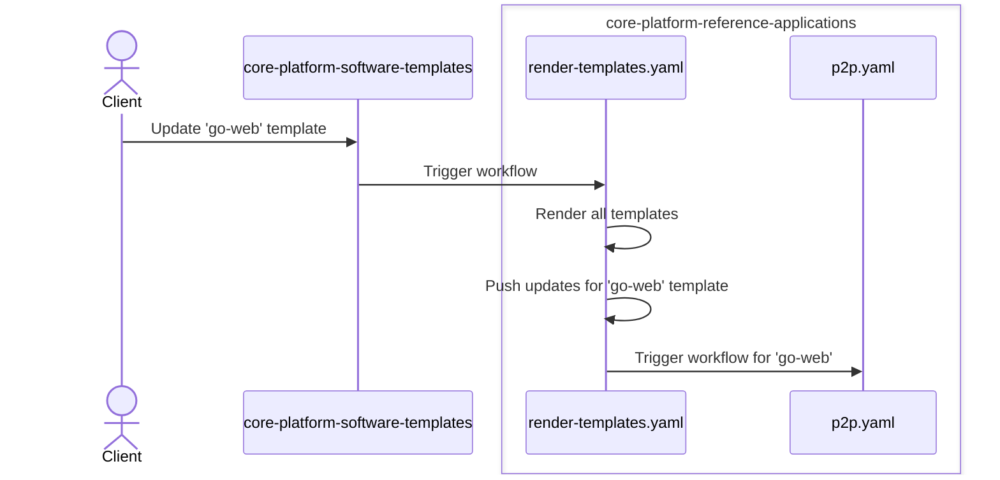

# Reference Apps

This repository contains rendered templates from [core-platform-software-templates](https://github.com/coreeng/core-platform-software-templates) repository.
Every time any template is changed `render-templates.yaml` workflow is triggered.
This workflow will render all templates, commit the changes and run the whole P2P for updated templates.
Here is a quick diagram describing with an example of the process:


Hence, changes to applications are happening automatically
and any application update made directly to this repository will be overwritten.
If you want to update an application, please make a PR
to [core-platform-software-templates](https://github.com/coreeng/core-platform-software-templates) repository.

# Quick Start
_*Prerequisite*_: it is assumed that you have `corectl` installed and initialized.
Read more about `corectl` [here](https://github.com/coreeng/corectl).

You can fork this repository to your organization and use it as a starting point for your own applications.

The only thing you need to do to make P2P work properly for your organization is to run:
```bash
corectl p2p env sync <your-repository> <your-tenant>
```
This will use configuration from your environments to prepare your repository for P2P.

In addition, it's recommended that you also delete workflows which are used to maintain this repository:
```bash
rm .github/workflows/render-template.yaml .github/workflows/p2p.yaml
git commit -m "Delete maintaining workflows"
git push
```

# Configured workflows

## Template rendering
These are used to render templates. Should be deleted after forking.
- [render-template.yaml](.github/workflows/render-templates.yaml) -
  fetches all the templates from [core-platform-software-templates](https://github.com/coreeng/core-platform-software-templates) repo, 
    renders it and collect ids of changed templates.
  For each changed template, it calls `p2p.yaml`. 
- [p2p.yaml](.github/workflows/p2p.yaml) - runs the whole Path To Production (P2P) in one go.

## P2P workflows for forked repository
These workflows are supposed to be used after forking the repository.
- [fast-feedback.yaml](.github/workflows/fast-feedback.yaml), [extended-test.yaml](.github/workflows/extended-test.yaml), [prod.yaml](.github/workflows/prod.yaml) - run certain P2P stage for a given application.
- [matrix-fast-feedback.yaml](.github/workflows/matrix-fast-feedback.yaml),
  [matrix-extended-test.yaml](.github/workflows/matrix-extended-test.yaml),
  [matrix-prod.yaml](.github/workflows/matrix-prod.yaml) -
  generate matrix of applications to be handled for a certain P2P stage.
    [matrix-extended-test.yaml](.github/workflows/matrix-extended-test.yaml) and [matrix-prod.yaml](.github/workflows/matrix-prod.yaml) are triggered on schedule or manual call.
    [matrix-fast-feedback.yaml](.github/workflows/matrix-fast-feedback.yaml) is triggered on push to main to on PRs.
  only runs for applications that have changed.
- [find-lifecycles.yaml](.github/workflows/find-lifecycles.yaml) -
  helper workflow to find all lifecycles in the repository.
  Lifecycles are used to generate matrix to be handled by `matrix-*.yaml` workflows.
  Conceptually, lifecycles represent a unit of software which should have a separate P2P lifecycle, typically a single 
  application.
  Directory is considered to contain a lifecycle if it has Makefile with P2P targets.
